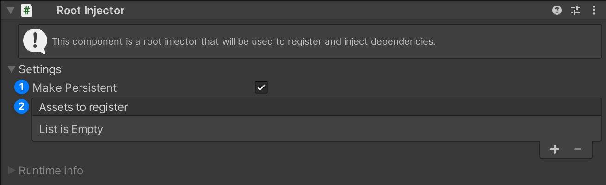
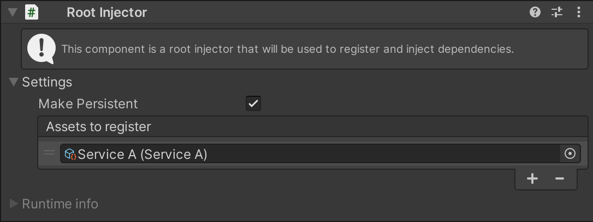
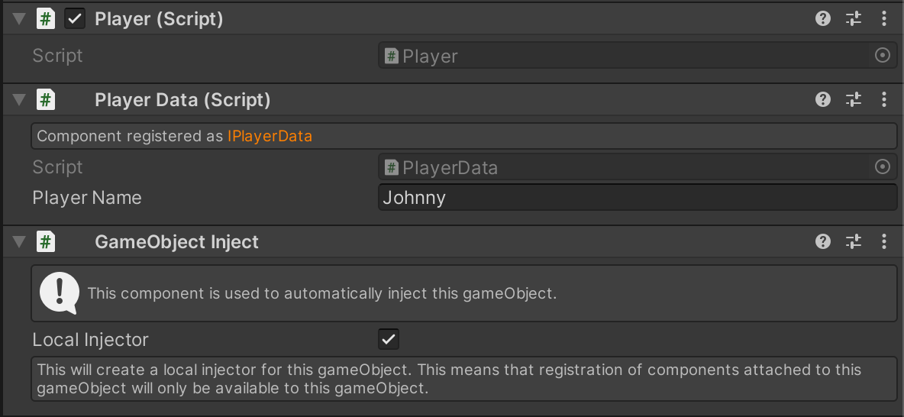
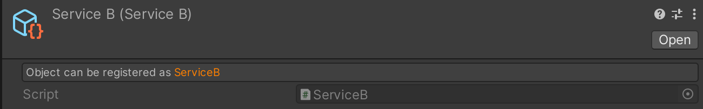
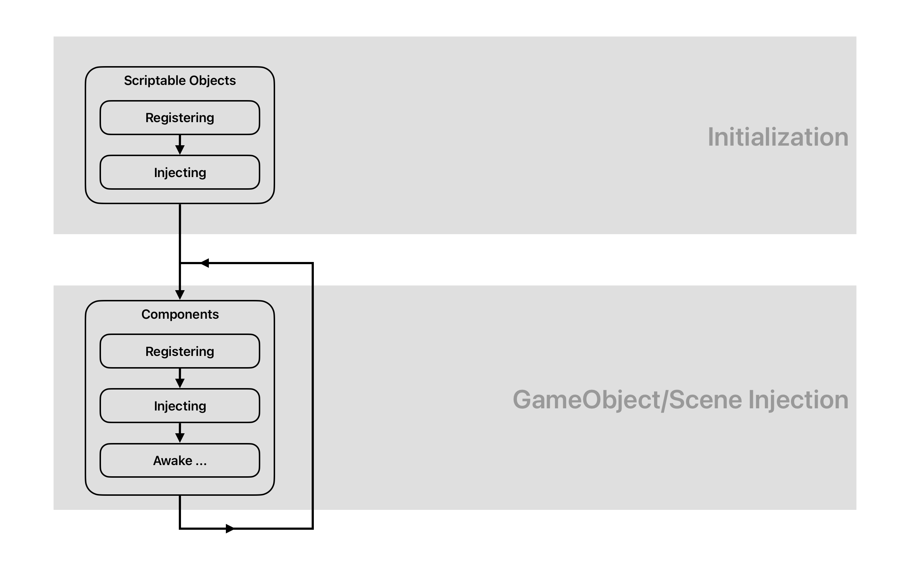

[](https://assetstore.unity.com/publishers/99093)
[](LICENSE)

# SInject
SInject is a dependency injection framework for unity. It is designed to be simple and easy to use. 
It is based on the concept of injectors and services. It is designed to be used in a way that is easy to understand and use. 
It also includes a testing framework that makes it easy to write tests for your code. Make sure to check out the samples to see how to use it.

## Installation

You can install SInject via Unity Package Manager. You will find it under `My Assets` section in Unity Package Manager.
If you are using custom assembly definition files, you will need to add `Sapo.DI.Runtime` assembly 
reference to your assembly definition file. If you are not using assembly definition files, you are all set.

## Features
- <span style="color:green">&#10003;</span> Simple and easy to use
- <span style="color:green">&#10003;</span> Supports DI for scenes and prefabs
- <span style="color:green">&#10003;</span> Allows for persistent objects across scenes
- <span style="color:green">&#10003;</span> Supports Components
- <span style="color:green">&#10003;</span> Supports Scriptable Objects
- <span style="color:green">&#10003;</span> Supports .net objects
- <span style="color:green">&#10003;</span> Supports circular dependencies
- <span style="color:green">&#10003;</span> Includes testing helpers

## How to use

-------------

### Setup root injector

In order to use SInject, we need to create a root injector.
This is the main injector that will be used to inject dependencies into our objects.
In our first scene, right click in the hierarchy and select `DI/Root Injector`.
> If you don't see the `DI/Root Injector` option, it means that root injector is already set up in the scene.

Now we will see in inspector a Root Injector component.
Root injector is a singleton, so we can only have **one in scene or one across scenes**.


As you can see, there are two sections (`Settings` and `Runtime info`), for now we will focus on the settings section.
There are two options:
1. `Make Persistent` - If this is checked, the root injector will not be destroyed when loading a new scene.
2. `Assets to register` - Here we can drag and drop scriptable objects that we want to register in the injector.
   Most of the time this will be your singleton services, their lifetime will be the same as the root injector's. Please note
   that you can only drag and drop scriptable objects that are defined with `SRegister` attribute.


Now after we have created the root injector, we also need to create `SceneInject` to mark this scene to be injected when loaded.
Right click in the hierarchy and select `DI/Scene Inject`.
> If you don't see the `DI/Scene Inject` option, it means that scene inject is already set up in the scene.

`Scene Inject` is a component that injects entire scene when scene is being loaded. Please note that after scene is loaded, 
gameObject on which `Scene Inject` is attached will be destroyed.

### Setup a scriptable object service

In order to inject a scriptable object, we need to define it with `SRegister` attribute.
```csharp
using Sapo.DI.Runtime.Attributes;

[CreateAssetMenu(menuName = "ServiceA")]
[SRegister(typeof(IServiceA))] // This is the interface that we want to inject, we can also use the concrete class
public class ServiceA : ScriptableObject, IServiceA
{
    public void Introduce()
    {
        Debug.Log("Hello, I am ServiceA!");
    }
}
```
Now in unity, create this scriptable object and drag it to the `Assets to register` field in the root injector.

[](Documentation~/service-a.png)

### Setup a Component service

In order to inject a component, we need to define it with `SRegister` attribute.
```csharp
using Sapo.DI.Runtime.Attributes;

[SRegister(typeof(IServiceB))] // This is the interface that we want to inject, we can also use the concrete class
public class ServiceB : MonoBehaviour, IServiceB
{
    public void Introduce()
    {
        Debug.Log("Hello, I am ServiceB!");
    }
}

```

### Injecting dependencies

With the setup of our root injector and the registration of our scriptable object services, we are now equipped 
to inject our dependencies into various components or other scriptable objects. This allows us to utilize 
the power of dependency injection, promoting loose coupling and enhancing the modularity and testability of our code.

We can now inject dependencies into components or other scriptable objects.
```csharp
using Sapo.DI.Runtime.Attributes;

public class Player : MonoBehaviour
{
    [SInject] private IServiceA _serviceA;
    [SInject] private IServiceB _serviceB;

    private void Awake()
    {
        _serviceA.Introduce();
        _serviceB.Introduce();
    }
}
```

In this point, we can create a prefab with `Player` script attached to it and when we run the game, we will see in the console:
```   
Hello, I am ServiceA!
Hello, I am ServiceB!
```

### Spawning prefabs with dependencies

When we want to spawn a prefab and execute injection on it, we need to add `GameObject Inject` on root object of prefab.
This component will schedule injection on this gameObject and all its children. After injection is done, `GameObject Inject` 
will be destroyed. To add `GameObject Inject` to prefab, click on `Add Component` and search for `GameObject Inject` or 
select `Sapo/DI/GameObject Inject` in context menu.

In `GameObject Inject` component, we can also see a `Local Injector` toggle. If this is checked, `GameObject Inject` will
create a new injector that will be used only for this gameObject. This is useful when we want to have services that are only
available to specific gameObject. We can register to `Local Injector` both component services and scriptable object services as well.

[](Documentation~/game-object-inject.png)

### Custom Injection

If you want to register or inject dependencies in a own way, you can can implement 
`ISInjectorRegisterHandler` and `ISInjectorInjectHandler` interfaces.

```csharp
using Sapo.DI.Runtime.Interfaces;

public class Service : MonoBehaviour, IService, ISInjectorRegisterHandler, ISInjectorInjectHandler
{
    [SInject] private ISInjector _injector;
    
    void ISInjectorRegisterHandler.OnRegister(ISInjector injector)
    {
        injector.Register<IService>(this);
    }

    void ISInjectorInjectHandler.OnInject(ISInjector injector)
    {
        injector.Inject(this);
    }
    
    private void OnDestroy()
    {
        _injector.Unregister<IService>(this);
    }
}
```

### Custom Editor GUI for Registered Services

If you create a custom Unity editor for a Unity component or ScriptableObject that is defined with the `SRegister` attribute, 
you can manually call `SRegisterGUI.DrawInfo(target)` to draw information about the service. 
This allows you to customize the way the service information is displayed in the Unity editor.

Here's how it looks when no custom editor is used:
[](Documentation~/register-info-gui.png)

Here's an example of how you can use `SRegisterGUI.DrawInfo(target)` in your custom editor:
```csharp
using UnityEditor;
using UnityEngine;

[CustomEditor(typeof(MyComponent))]
public class MyComponentEditor : UnityEditor.Editor
{
    public override void OnInspectorGUI()
    {
        SRegisterGUI.DrawInfo(target);
        DrawDefaultInspector();
    }
}
```

This will draw the service information at the top of the inspector for `MyComponent`, followed by the default inspector.
> Please note that if you are using custom assembly definition files, you will need to add `Sapo.DI.Editor` assembly 

### Testing

The best feature of dependency injection is that it makes testing easier.
Here is a self-explanatory example of how to test a component that uses dependency injection.

```csharp
 [TestFixture]
 public class PlayerTests
 {
     private STestGameObjectHelper _gHelper;

     [SetUp]
     public void SetUp()
     {
         _gHelper = new STestGameObjectHelper();
     }
     
     [TearDown]
     public void TearDown()
     {
         _gHelper.Dispose();
     }
     
     [Test]
     public void TakeDamage_With10Damage_ShouldReduceHealthBy10()
     {
         // Arrange
         var playerG = _gHelper.CreateG<Player>();
         var player = playerG.GetComponent<Player>();
         var injector = new STestGamObjectInjector(playerG);
         
         // Mocking the health component
         var health = new Mock<IHealth>();
         health.SetupGet(h => h.Value).Returns(100);
         health.SetupSet(h => h.Value = It.IsAny<int>()).Verifiable();
         
         // Injecting the health component
         injector.Register<IHealth>(health.Object);
         
         // Finally activating player game object
         injector.Activate();
         
         // Act
         player.TakeDamage(10);
         
         // Assert
         health.VerifySet(h => h.Value = 90, Times.Once);
     }
 }
```

> Please not that if you want to use test injector helpers, you will need to add `Sapo.DI.Runtime.Tests` assembly reference to your test assembly definition file.
> For more information about testing, you can check `Testing` sample.

## Samples

You can install samples via Unity Package Manager. Go to `Window/Package Manager`, select `In Project` tab and search for `SInject`.
You will see `Samples` section where you can install samples.


## Injection Pipeline

> Please keep in mind that this framework is heavily using reflection to register and inject dependencies.
> Also this framework can have a big performance peeks when loading huge scenes.

When a scene a scene is loaded or a prefab is spawned, the injection pipeline is executed.

[](Documentation~/injection-pipeline.png)

The initialization phase, which is responsible for registering service assets, is executed only once on root injector.

## License

This project is licensed under the MIT License - see the [LICENSE](LICENSE) file for details.
